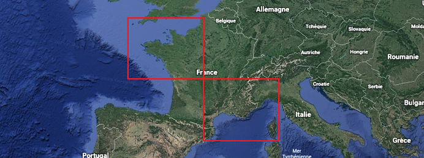

Welcome to [MeteoNet](linktowebsite)'s documentation! 
## What is MeteoNet ?

MeteoNet is an open meteorological dataset created by METEO FRANCE, the French national meteorological service. Our goal is to provide a clean and ready-to-use dataset for Data Scientists who want to try their hand on weather data.

The data spans over 3 years, 2016 to 2018, and covers two geographical areas : the north-western and south-eastern quarters of France.

The dataset regroups **ground station observations**, **land-sea and relief masks**, **rain radar observations**, and **weather forecasting models**. We also plan to give you satellite images very soon!

If you want to **start exploring our dataset**, check out [Getting Started with MeteoNet](getting-started)!

## Why MeteoNet?

A complete and clean dataset is a rare and precious thing for a data scientist, and this is what we wanted to provide to the community.

As we are always willing to improve our knowledge of meteorology and weather forecasting, we hope that by opening this dataset to the research community, people aroud the world will find new ways of bringing value to meteorology with data science.

## About Us

METEO FRANCE is the French national meteorological service. Its mission is to ensure the meteorological safety of life and property accross the French territory. Another mission is to keep memory of climate and forecasting the climate change to advise the public policies. METEO FRANCE has a particularly strong international presence, and is the French representative at the World Meteorological Organization. The organisation is a leading member of EUMETSAT, responsible for the procurement of Meteosat weather satellites. It also a critical national weather service member of the ECMWF and hosts one of two major centers of the IFS numerical weather prediction model widely used worldwide. 